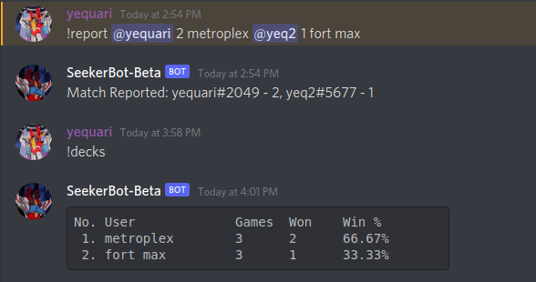
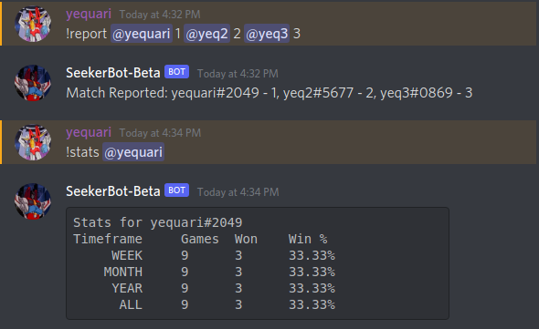

# SeekerBot 2.0.0

## New Features

### Backend upgrades
SeekerBot now uses a REST API to report and retrieve data. This doesn't provide much functionality to users (yet) but enables more complex features in the future. 

In addition, Discord has been changing their bot policies recently and will stop letting bots read full message contents starting early next year, requiring them instead to use "slash commands". This policy is supposed to only affect bots in more than 100 guilds, which would leave SeekerBot unaffected, however the writing is on the wall. As a result of these policy changes, the developer of discord.py, the Python library which SeekerBot uses under the hood, has stopped further development. This means in the future, SeekerBot may need to be rewritten in a different language (or library) if Discord's bot policy undergoes further changes. Luckily, the upgrades to the SeekerBot backend allow for an easier time migrating SeekerBot to follow the new rules.

### Per-Channel Reports
Matches reported to SeekerBot now record which channel they were reported in. Matches reported before v2.0.0 will not have a channel associated with them. Leaderboards will still track matches across all channels in a guild. 

### Deck Reporting
You can now include deck names with your SeekerBot reports. There is also a leaderboard for decks, accessed with the new `!decks` command. This command will collect and display stats for decks that have been reported **in the current channel only.** For example:

### Primus Match Reporting
Primus matches can now be properly reported to SeekerBot. The syntax is the same as a normal report, except you can add an arbitrary number of users. For example:

### User Stats Changes
Per-user stats is one of the lesser used features of SeekerBot. Currently, stats just shows your personal wins/total games entry within each leaderboard. It does not give any information that is not presented in leaderboard output. In the future, I want to expand the amount of stats that SeekerBot provides, but for now the stats command now follows wins/total games in the past 30 days, 90 days, and all time to provide something (slightly) different than the leaderboard command.

### Undo Match Reports
The undo command will now attempt to undo the most recent game that the user participated in, instead of the most recent game the user reported. The undo time limit has increased to 60 minutes.

## Other Changes

These are some smaller changes to address some feedback

- Leaderboard time cutoffs now follow EST timezone
- Added help text with examples for each command

These are features that have been pushed to the next minor release
- [ ] Stats command for decks
- [ ] Command options for accessing past leaderboards (For example, see the leaderboard for July 2021)